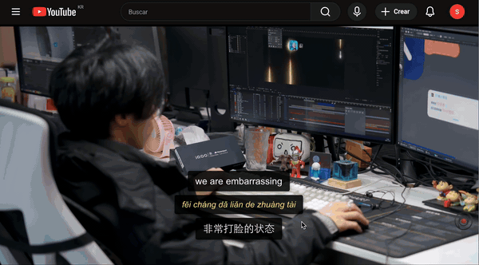
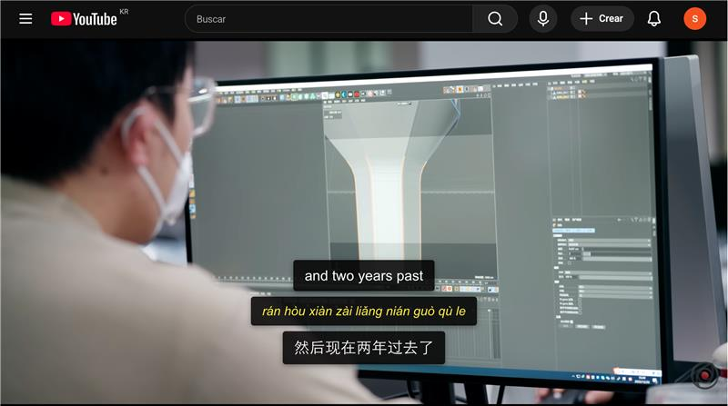
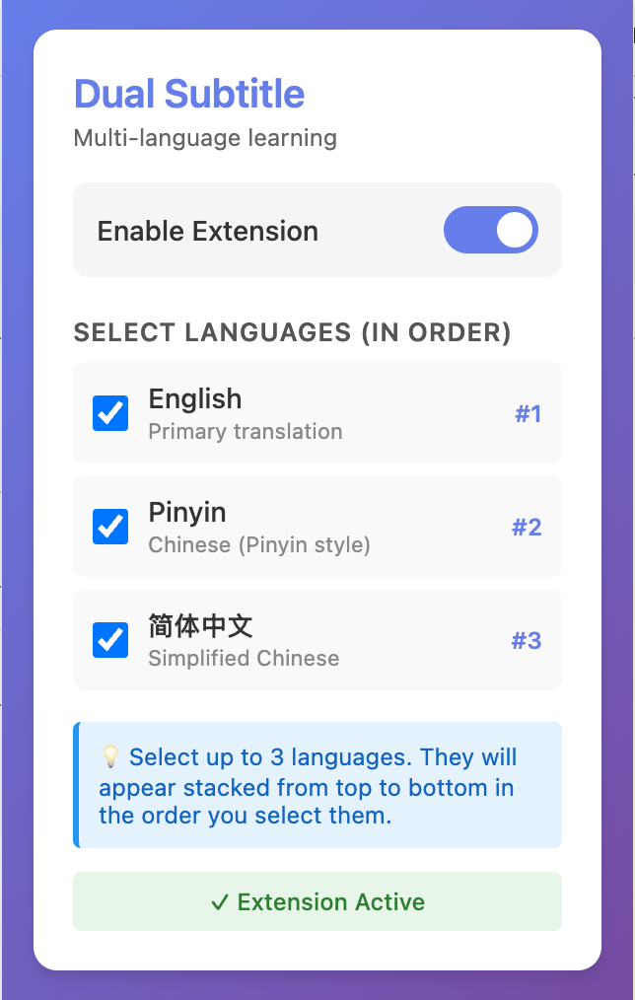

# Dual Subtitle for YouTube

A Chrome extension that displays multiple subtitles simultaneously on YouTube videos, perfect for language learning. Display English, Pinyin, and Chinese subtitles at the same time!

## 🎬 Demo



> English, Pinyin, and Simplified Chinese shown together, in sync with the video. ([full-quality MP4](assets/demo.mp4))

## 📸 Screenshots

| Stacked subtitles on YouTube | Extension popup |
| :---: | :---: |
|  |  |
| English + Pinyin + Simplified Chinese displayed at once | Toggle the extension and pick up to 3 languages in order |

## 🌟 Features

- **Multiple Subtitles**: Display up to 3 subtitle tracks simultaneously
- **Language Learning**: Perfect for studying Chinese with English, Pinyin, and Simplified Chinese
- **Customizable**: Choose which languages to display and in what order
- **Seamless Integration**: Works naturally with YouTube's interface
- **Beautiful Design**: Modern, readable subtitle styling with proper contrast
- **Easy Toggle**: Enable/disable with a single click

## 📦 Installation

### Method 1: Install from Chrome Web Store (Recommended)
*Coming soon - once published*

### Method 2: Install Locally (Developer Mode)

1. **Download or Clone this Repository**
   ```bash
   git clone https://github.com/erjui/MandaLearn.git
   cd MandaLearn
   ```

2. **Generate Icons**
   - Open `icons/generate-icons.html` in your browser
   - Click "Download All Icons" button
   - Save the three PNG files (icon16.png, icon48.png, icon128.png) to the `icons/` folder

3. **Load Extension in Chrome**
   - Open Chrome and navigate to `chrome://extensions/`
   - Enable "Developer mode" (toggle in top-right corner)
   - Click "Load unpacked"
   - Select the `dual_subtitle` folder
   - The extension should now appear in your toolbar!

## 🚀 Usage

1. **Navigate to YouTube**
   - Go to any YouTube video with subtitles/captions available

2. **Enable Subtitles on YouTube**
   - Make sure YouTube's native subtitles are enabled
   - Click the CC (Closed Captions) button in the video player

3. **Configure Dual Subtitle**
   - Click the Dual Subtitle extension icon in your toolbar
   - Toggle the extension ON
   - Select which languages you want to display (up to 3)
   - Languages will appear in the order you select them

4. **Watch and Learn!**
   - Subtitles will appear stacked on top of each other
   - Enjoy learning with multiple languages simultaneously

## ⚙️ Configuration Options

- **Enable/Disable**: Quick toggle to turn the extension on/off
- **Language Selection**: Choose from:
  - English
  - Pinyin (Chinese with Pinyin styling)
  - Simplified Chinese (简体中文)
- **Display Order**: Languages appear in the order you select them (top to bottom)

## 📝 How It Works

The extension:

1. **Extracts YouTube's Player Data**: Accesses the `ytInitialPlayerResponse` object that contains subtitle/caption track information
2. **Fetches Subtitle Tracks**: Downloads the timedtext XML files for each selected language directly from YouTube
3. **Parses Timing Data**: Processes the XML to extract subtitle text and timing information (start time, duration)
4. **Displays Subtitles**: Shows the appropriate subtitle for each language based on the current video time
5. **Subtitle Overlap**: Properly handles timing so multiple subtitles appear simultaneously without conflict

## 📝 Current Limitations

1. **Available Subtitles**: Can only display languages that have subtitle tracks on the YouTube video
   - If a video doesn't have Chinese subtitles, the Chinese option won't work
   - Most popular videos have English and Chinese (auto-generated or manual)

2. **Pinyin Conversion**: Currently displays Chinese characters with pinyin styling
   - True pinyin romanization requires additional library integration
   - Future versions may include automatic Chinese-to-Pinyin conversion using libraries like pinyin-pro

3. **Language Support**: Currently supports English, Pinyin (styled Chinese), and Simplified Chinese
   - Traditional Chinese support has been removed (can be re-added if needed)

## 🛠️ For Developers

### Project Structure

```
dual_subtitle/
├── manifest.json          # Extension configuration (Manifest V3)
├── content.js            # Main content script (runs on YouTube pages)
├── inject.js             # Injected script to access page context
├── background.js         # Background service worker
├── popup.html            # Extension popup interface
├── popup.js              # Popup logic
├── styles.css            # Subtitle styling
├── icons/                # Extension icons
│   ├── icon16.png       # 16x16 toolbar icon
│   ├── icon48.png       # 48x48 management icon
│   ├── icon128.png      # 128x128 store icon
│   ├── icon.svg         # Source SVG
│   └── generate-icons.html  # Icon generator tool
└── README.md            # This file
```

### Technical Details

- **Manifest Version**: V3 (latest Chrome extension standard)
- **Permissions**: 
  - `storage` - Save user preferences
  - `activeTab` - Access current YouTube tab
- **Content Script**: Injects into YouTube pages to capture and display subtitles
- **Service Worker**: Manages extension state and context menu

### Enhancing the Extension

To add full multi-language subtitle support:

1. **Integrate YouTube Data API**
   ```javascript
   // Fetch available caption tracks
   const apiKey = 'YOUR_API_KEY';
   const videoId = extractVideoId();
   const response = await fetch(
     `https://www.googleapis.com/youtube/v3/captions?videoId=${videoId}&key=${apiKey}`
   );
   ```

2. **Add Pinyin Conversion**
   ```javascript
   // Option 1: Use a library (requires bundling)
   import { pinyin } from 'pinyin-pro';
   const pinyinText = pinyin(chineseText, { toneType: 'symbol' });

   // Option 2: Call external API
   const response = await fetch(`https://api.pinyin.service/${chineseText}`);
   ```

3. **Parse TimedText Format**
   ```javascript
   // YouTube's subtitle format (simplified)
   async function fetchTimedText(captionUrl) {
     const response = await fetch(captionUrl);
     const xml = await response.text();
     // Parse XML to extract timestamps and text
     return parseSubtitles(xml);
   }
   ```

## 📤 Publishing to Chrome Web Store

### Prerequisites

1. **Google Account**: You'll need a Google account
2. **Developer Fee**: One-time $5 registration fee
3. **Required Assets**:
   - Extension files (already included)
   - Icons in 3 sizes (use the generator)
   - Screenshots (1280x800 or 640x400)
   - Promotional images (optional but recommended)

### Step-by-Step Publication

1. **Register as Chrome Web Store Developer**
   - Go to [Chrome Web Store Developer Dashboard](https://chrome.google.com/webstore/devconsole/)
   - Pay the one-time $5 registration fee

2. **Prepare Your Package**
   - Ensure all icons are generated and in the `icons/` folder
   - Test the extension thoroughly in developer mode
   - Prepare screenshots of the extension in action

3. **Create Store Listing**
   - Click "New Item" in the Developer Dashboard
   - Upload a ZIP file of your extension folder:
     ```bash
     zip -r dual-subtitle.zip . -x "*.git*" "*.DS_Store" "*generate-icons.html"
     ```

4. **Fill in Store Listing Details**
   - **Name**: Dual Subtitle for YouTube
   - **Summary**: Display multiple subtitles simultaneously on YouTube - perfect for language learning
   - **Description**: Use the expanded description below
   - **Category**: Productivity or Education
   - **Language**: English (and other languages you support)

5. **Upload Assets**
   - **Small Icon**: 128x128 PNG (use icon128.png)
   - **Screenshots**: At least 1, recommended 3-5 (1280x800 or 640x400)
   - **Promotional Tile**: 440x280 PNG (optional)
   - **Marquee**: 1400x560 PNG (optional)

6. **Privacy Practices**
   - **Single Purpose**: Educational tool for language learning
   - **Permissions Justification**:
     - `storage`: Save user language preferences
     - `activeTab`: Interact with YouTube video player
     - `host_permissions`: Only runs on youtube.com
   - **Data Usage**: No data collection or transmission

7. **Submit for Review**
   - Review all information
   - Click "Submit for Review"
   - Wait for approval (typically 1-3 days for first submission)

### Store Listing Description Template

```
📚 Learn languages faster with Dual Subtitle for YouTube!

Display multiple subtitles simultaneously while watching YouTube videos - perfect for Chinese language learners who want to see English translations, Pinyin romanization, and Chinese characters all at once.

✨ KEY FEATURES:
• Display up to 3 subtitle tracks at the same time
• Perfect for Chinese learners: English + Pinyin + Chinese
• Customizable display order
• Beautiful, readable styling
• Works seamlessly with YouTube's interface
• Easy on/off toggle

🎯 PERFECT FOR:
• Chinese language students
• Mandarin learners of all levels
• Anyone studying with YouTube videos
• Teachers creating language learning content

🚀 HOW TO USE:
1. Install the extension
2. Go to any YouTube video with subtitles
3. Enable YouTube's captions (CC button)
4. Click the extension icon to select languages
5. Watch with multiple subtitles displayed!

🎨 FEATURES:
- Clean, modern interface
- Adjustable language selection
- Respects fullscreen mode
- Responsive design for all screen sizes
- No data collection or tracking

Start learning more effectively today with Dual Subtitle!

---
Note: Requires YouTube videos to have available subtitle tracks in your selected languages.
```

### Required Screenshots

Capture these screenshots for your store listing:

1. **Main Feature**: YouTube video showing 3 subtitles stacked
2. **Popup Interface**: The extension settings popup
3. **Language Selection**: Highlighting the language selection feature
4. **Before/After**: Comparison of single vs. multiple subtitles

Tips for screenshots:
- Use 1280x800 resolution
- Show the extension actively working
- Use a clean, well-lit video example
- Highlight the subtitle display clearly

### Privacy Policy

If you collect any data, you'll need a privacy policy. For this extension (which doesn't collect data):

```
Privacy Policy for Dual Subtitle for YouTube

Data Collection: This extension does NOT collect, store, or transmit any personal data.

Local Storage: The extension only stores your language preferences locally on your device using Chrome's storage API. This data never leaves your computer.

Permissions:
- storage: Used only to save your language preferences locally
- activeTab: Used only to interact with YouTube video player on active tab
- host_permissions (youtube.com): Extension only runs on YouTube pages

Third-Party Services: This extension does not use any third-party services or analytics.

Contact: [Your email address]
```

## 🐛 Troubleshooting

### Extension not working?
1. Make sure you're on a YouTube video page
2. Verify YouTube's native captions are enabled (CC button)
3. Check that the extension is enabled in the popup
4. Try refreshing the page
5. Check browser console for errors (F12 → Console tab)

### No subtitles appearing?
1. Verify the video has subtitles in your selected languages
2. Make sure YouTube's captions are turned ON
3. Try selecting different languages in the extension popup
4. Some videos may not have all language tracks available

### Subtitles overlapping or misaligned?
1. Try disabling/re-enabling the extension
2. Refresh the page
3. Check if YouTube's native subtitles are positioned correctly

## 🤝 Contributing

Contributions are welcome! Areas for improvement:

1. Direct subtitle fetching from YouTube's TimedText API
2. Automatic Pinyin conversion for Chinese text
3. Support for more languages
4. Customizable subtitle styling (fonts, colors, sizes)
5. Subtitle position adjustment
6. Export subtitle tracks
7. Keyboard shortcuts

## 📄 License

MIT License - feel free to modify and distribute

## 📧 Support

For issues, questions, or suggestions:
- Open an issue on GitHub
- Email: [your-email@example.com]

## 🙏 Acknowledgments

- Built for language learners worldwide
- Inspired by the need for better multi-lingual learning tools
- Thanks to the Chrome Extension API and YouTube platform

---

**Note**: This extension is not affiliated with YouTube or Google. It's an independent project created to enhance language learning through better subtitle display.

